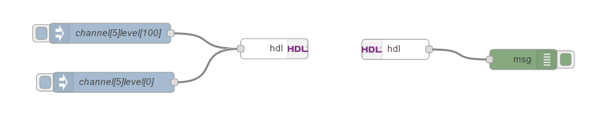
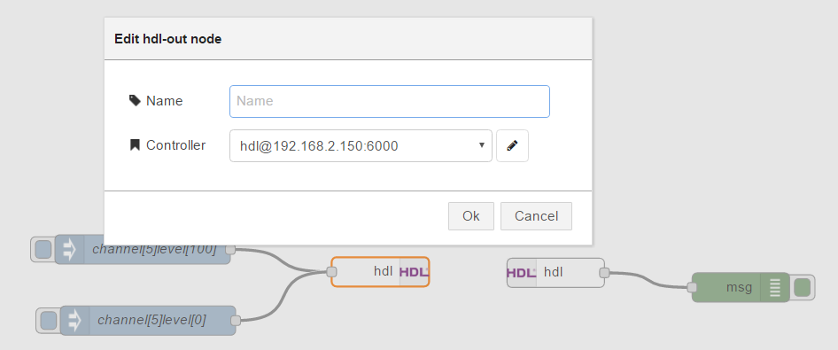
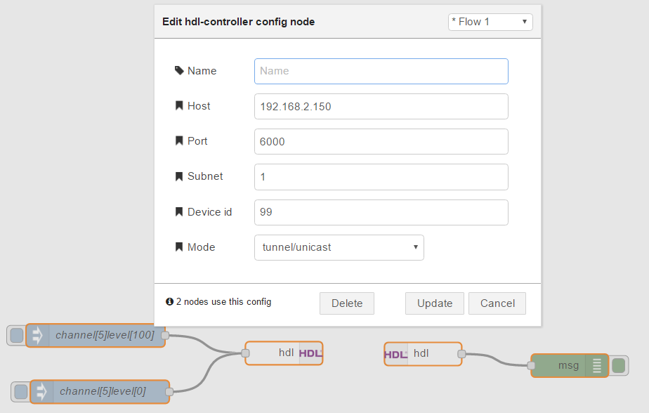
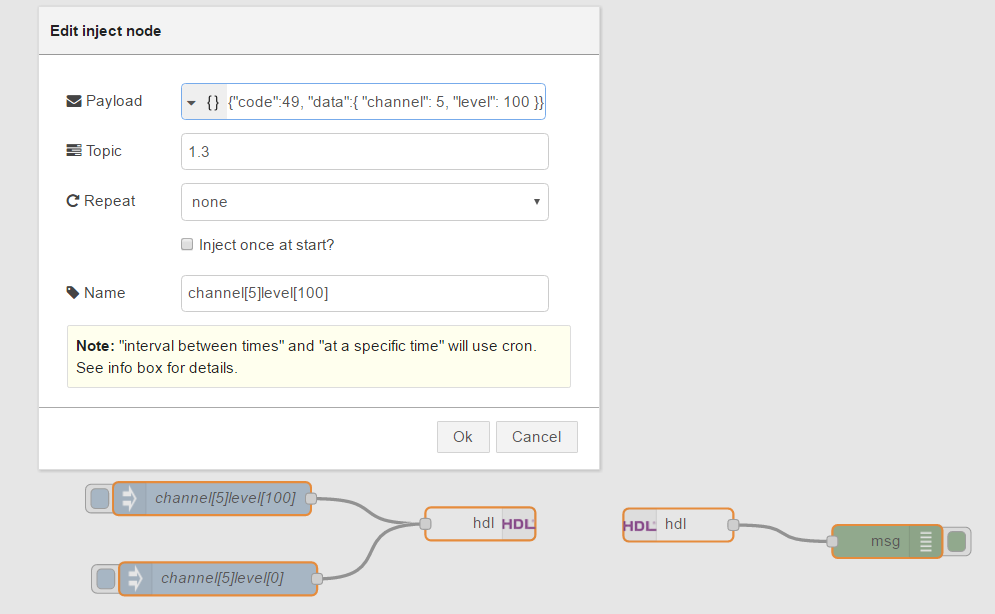

node-red-contrib-hdl
==========================
## Description
HDL nodes for node-red.

HDL for node-red, utilizing pure JavaScript HDL Buspro driver (working in tunneling mode).
Based on https://github.com/caligo-mentis/smart-bus. 

## Install via NPM

From inside your node-red directory:
```
npm install node-red-contrib-hdl
```

## What's inside?

It includes three nodes:

1. ```hdl-controller``` : a unique CONFIG node that holds connection configuration for hdl and will acts as the encapsulator for HDL access. As a node-red 'config' node, it cannot be added to a graph, but it acts as a singleton object that gets created in the the background when you add an 'hdl-in' or 'hdl-out' node and configure it accordingly.

2. ```hdl-out``` : HDL output node that can send HDL commands to a HDL network:
```
{  
   "topic": "1.3",
   "payload": {  
      "code": 39,
      "data": {
        "channel": 5,
        "level": 100
      }
   }
}
```
- ```topic``` can contain target address, for example ```1.3```, where ```1``` is subnet number and ```3``` is device number.
- ```payload``` must be a JavaScript object or a string in JSON format, which contains fields:
 - ```device``` - device number of target (example: ```1.3```). It can be empty, then ```msg.topic``` field will be handled as target device number
 - ```code``` (alias: ```cmd``` and ```command```) - command code (example: ```39```). Full list of operation codes take here:  https://raw.githubusercontent.com/estbeetoo/node-red-contrib-hdl/master/doc/HDL-BUS%20Pro%20operation%20codes(Eng)%20Jan%2008%202013.pdf
 - ```data``` (aliases: ```params``` and ```args```) - object with different fields for specified operation code.
  - Operation code ```0x0031``` (decimal ```49```):
   - ```data.channel``` - integer, channel number of DMX dimmer, for example.
   - ```data.level``` - integer, level of luminosity to be set to the channel.
   - ```data.time``` - integer, how many time level change should take[TODO: write the number range here].
  - Operation code ```0x0032``` (decimal ```50```):
   - ```data.channel``` - integer, channel number of DMX dimmer, for example.
   - ```data.success``` - any type, if it can be interpreted as Boolean ```true```, value of ```0xF8``` will be sent. Otherwise, ```0xF5``` will be sent.
   - ```data.value``` - integer, value to be set to the channel. 
  - Operation code ```0xE01C``` (decimal ```57372```):
   - ```data.switch``` - integer, number of switch.
   - ```data.status``` - any type, if it can be interpreted as Boolean ```true``` integer value ```255``` will be sent to the switch. Otherwise, ```0``` will be sent.
3. ```hdl-in``` : HDL listener node, who emits flow messages based on activity on the HDL bus.
 
## Usage


###'hdl-in' and 'hdl-out' node configuration:



###'hdl-controller' CONFIG node configuration:



### How send value to HDL by Inject-node:



According to official documentation: http://nodered.org/docs/getting-started/adding-nodes.html
 
# License

